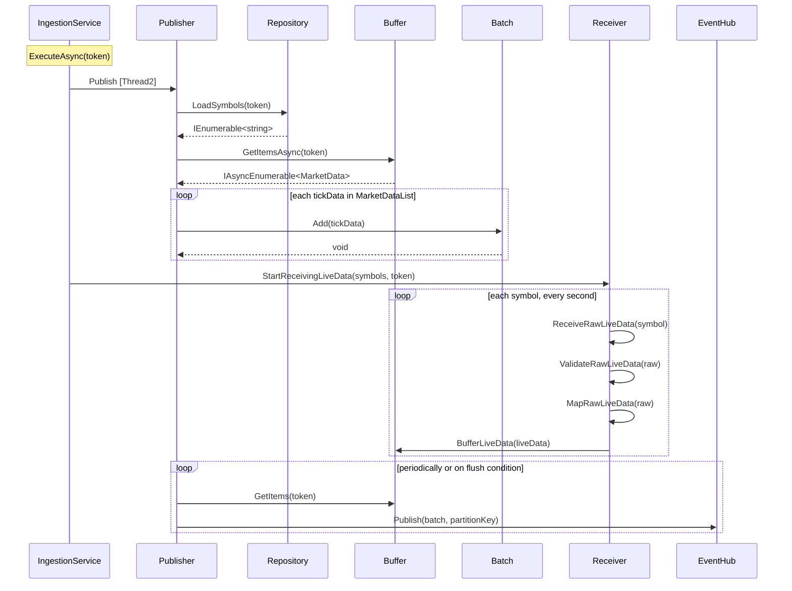

# Live Data Ingestion

```mermaid
sequenceDiagram
    participant IngestionService
    participant Publisher
    participant Repository
    participant Buffer
    participant Batch
    participant Receiver
    participant EventHub

    Note over IngestionService: ExecuteAsync(token)

  

    IngestionService->>Publisher: Publish [Thread2]

    Publisher->>Repository: LoadSymbols(token)
    Repository-->>Publisher: IEnumerable<string>

    Publisher->>Buffer: GetItemsAsync(token) 
    Buffer-->>Publisher: IAsyncEnumerable<MarketData>

    loop each tickData in MarketDataList
      Publisher->>Batch: Add(tickData)
      Batch-->>Publisher: void
    end
    
    IngestionService->>Receiver: StartReceivingLiveData(symbols, token)
    
    loop each symbol, every second
        Receiver->>Receiver: ReceiveRawLiveData(symbol)
        Receiver->>Receiver: ValidateRawLiveData(raw)
        Receiver->>Receiver: MapRawLiveData(raw)
        Receiver->>Buffer: BufferLiveData(liveData)
    end

    loop periodically or on flush condition
        Publisher->>Buffer: GetItems(token)
        Publisher->>EventHub: Publish(batch, partitionKey)
    end

```
